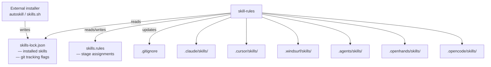
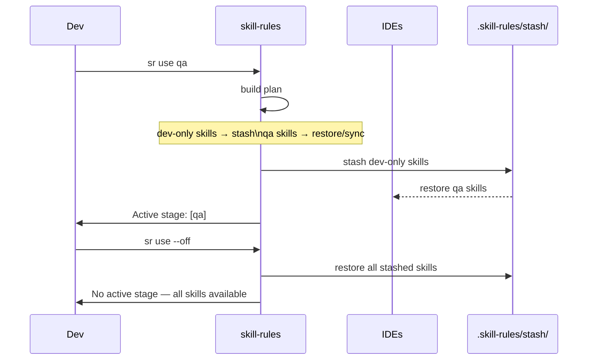
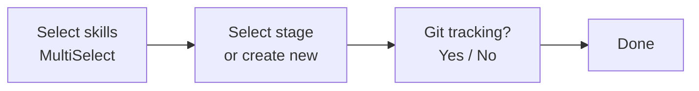

# skill-rules

> Sync AI agent skills across every IDE and activate per-stage rule sets — all from one command.

[](https://www.npmjs.com/package/skill-rules)
[](https://www.npmjs.com/package/skill-rules)
[](https://github.com/carrilloapps/skill-rules/actions/workflows/ci.yml)
[](https://opensource.org/licenses/MIT)
[](https://nodejs.org)
[](https://prettier.io)
[](./CONTRIBUTING.md)

---

## What it does

When you work with AI coding assistants across multiple IDEs, each tool stores skills (system prompts, rules, context files) in its own directory. Installing a skill in Claude Code doesn't make it available in Cursor or Windsurf — and sharing those files across your team via git quickly becomes noisy.

**skill-rules** solves this in two ways:

1. **Sync** — copies skills from whichever IDE has them to every other IDE in the project.
2. **Stages** — lets you define which skills are active per environment (`dev`, `qa`, `production`…) and switch between them with a single command that stashes/restores skill directories locally without touching git.

```
sr use dev        # activate dev stage — stash everything else
sr                # sync active skills across all IDEs
sr use --off      # restore all skills, clear active stage
```

---

## Supported IDEs

| IDE                                         | Detected by   | Skills directory     |
| ------------------------------------------- | ------------- | -------------------- |
| Claude Code                                 | `.claude/`    | `.claude/skills/`    |
| Cursor                                      | `.cursor/`    | `.cursor/skills/`    |
| Windsurf                                    | `.windsurf/`  | `.windsurf/skills/`  |
| OpenHands                                   | `.openhands/` | `.openhands/skills/` |
| OpenCode                                    | `.opencode/`  | `.opencode/skills/`  |
| GitHub Copilot, Cline, VS Code, Codex, Kiro | `.agents/`    | `.agents/skills/`    |

---

## Installation

```bash
npm install -g skill-rules
# or per-project
npm install --save-dev skill-rules
# or run without installing
npx skill-rules
```

Both `skill-rules` and `sr` are available as aliases after installation.

> **Using with `npx` (no install required)**
> Every command that uses `sr` in this documentation can be replaced with `npx skill-rules`:
>
> ```bash
> npx skill-rules init
> npx skill-rules add
> npx skill-rules use dev
> npx skill-rules        # sync
> ```

---

## Quick start

```bash
# 1. Inside your project, create the config files
sr init
# npx: npx skill-rules init

# 2. Install skills with your preferred tool (external)
npx autoskill   # or skills.sh

# 3. Assign skills to a stage (interactive)
sr add
# npx: npx skill-rules add

# 4. Activate the stage for your current environment
sr use dev
# npx: npx skill-rules use dev

# 5. Sync active skills across all IDEs
sr
# npx: npx skill-rules
```

Switch environments at any time:

```bash
sr use qa         # stash dev-only skills, activate qa skills
sr use --off      # restore everything, no active stage
```

---

## How it works



### Two files, two owners

| File               | Managed by                | Purpose                                                           |
| ------------------ | ------------------------- | ----------------------------------------------------------------- |
| `skills-lock.json` | `autoskill` / `skills.sh` | Records which skills are installed and which are committed to git |
| `skills.rules`     | `skill-rules`             | Records which skills belong to which stage                        |

`skill-rules` never installs or updates skills — that is the responsibility of your installer. It only reads from `skills-lock.json` and syncs across IDEs.

---

## Stage workflow



The stash lives in `.skill-rules/stash/` — always gitignored. Switching stages is instant and fully reversible without reinstalling anything.

---

## Commands

### `sr` / `skill-rules` / `npx skill-rules`

Sync all active skills across every detected IDE.

```bash
sr                         # sync using active stage (if set)
sr --stage qa              # sync only skills assigned to [qa]
npx skill-rules            # same, without global install
npx skill-rules --stage qa
```

Skills missing from one IDE are copied from another that has them. Skills missing from all IDEs are reported as `missing` — install them first with your installer.

---

### `sr init`

Create `skills-lock.json`, `skills.rules`, and update `.gitignore`.

```bash
sr init
```

Safe to run on an existing project — skips files that already exist.

---

### `sr add [skill] [--stage <name>] [--track]`

Assign skills to stages.

```bash
sr add                             # interactive wizard
sr add review                      # pre-select "review" in the wizard
sr add review --stage dev          # non-interactive: assign directly
sr add review --stage dev --track  # assign and commit to git
```

**Interactive wizard:**



The `--track` flag removes the skill from `.gitignore` so it is committed to the repository. By default all skills are gitignored — each developer installs their own copy.

---

### `sr remove [skill] [--stage <name>]`

Remove skill-to-stage assignments.

```bash
sr remove                          # interactive wizard
sr remove review                   # remove from all stages
sr remove review --stage dev       # remove only from [dev]
```

---

### `sr use [stage] [--off]`

Activate a stage — stashes skills not assigned to it, restores those that are.

```bash
sr use dev            # activate dev stage
sr use qa             # switch to qa stage
sr use                # show active stage and stash contents
sr use --off          # restore everything, clear active stage
```

**Plan preview before destructive changes:**

```
skill-rules use qa

  ✓ keep     review          (in [qa], already active)
  ✓ restore  linter          (in [qa], restoring from stash)
  ⚠ stash    debug-tools     (in [dev] only)
  ⚠ missing  qa-helper       (not installed)
  ● skip     security-audit  (tracked in git — always active)

  Skills marked "stash" will be removed from IDEs and saved locally.
  > Yes, activate stage
    Cancel
```

If no skills need to be stashed, the command executes without asking for confirmation.

**Rules:**

| Skill                               | Behaviour                                          |
| ----------------------------------- | -------------------------------------------------- |
| In target stage                     | Synced to all IDEs (restored from stash if needed) |
| In another stage, not target        | Moved to stash (removed from IDEs)                 |
| In multiple stages including target | Left active                                        |
| No stage assigned                   | Never touched — always available                   |
| Tracked in git                      | Never touched — always available                   |

---

### `sr list [--track <skill>] [--untrack <skill>]`

Show all installed skills with their stage assignments and git tracking status.

```bash
sr list                    # interactive — toggle git tracking
sr list --track review     # commit review to git
sr list --untrack review   # exclude review from git
```

---

### `sr ignore`

Regenerate the `# skill-rules [start]` / `# skill-rules [end]` block in `.gitignore`.

```bash
sr ignore
```

Useful after manually editing `.gitignore` or adding a new IDE directory.

---

### `sr help`

Show all commands and options.

```bash
sr help
```

For detailed help on a specific command, use the `--help` flag:

```bash
sr add --help
sr use --help
```

---

## Configuration files

### `skills-lock.json`

Managed by your skill installer. Do not edit manually.

```json
{
  "version": 1,
  "skills": {
    "review": {},
    "debug-tools": {},
    "security-audit": { "track": true }
  }
}
```

The `track: true` flag means the skill files are committed to the repository (not gitignored).

### `skills.rules`

Managed by `skill-rules`. Safe to commit to git.

```json
{
  "version": 1,
  "stages": {
    "dev": ["review", "debug-tools"],
    "qa": ["review", "linter"],
    "production": ["security-audit"]
  }
}
```

Skills not listed in any stage are always active regardless of the current stage.

---

## Git integration

By default `skill-rules` adds IDE skill directories to `.gitignore` automatically:

```
# skill-rules [start]
.skill-rules/
.claude/skills
.cursor/skills
.windsurf/skills
.agents/skills
.openhands/skills
# skill-rules [end]
```

To commit a specific skill to the repository (useful for team-wide shared skills):

```bash
sr list --track <skill-name>
# or during sr add:
sr add <skill> --stage dev --track
```

This adds a negation rule so only that skill escapes the gitignore:

```
!.claude/skills/security-audit
!.cursor/skills/security-audit
```

---

## Project structure

```
your-project/
├── skills-lock.json          # installed skills (managed by autoskill/skills.sh)
├── skills.rules              # stage assignments (managed by skill-rules)
├── .gitignore                # updated automatically
├── .skill-rules/             # local state — always gitignored
│   ├── state.json            # active stage
│   └── stash/                # stashed skill directories
│       └── debug-tools/
├── .claude/
│   └── skills/
│       └── review/
├── .cursor/
│   └── skills/
│       └── review/
└── .windsurf/
    └── skills/
        └── review/
```

---

## Requirements

- Node.js >= 20 (LTS)
- At least one IDE directory (`.claude`, `.cursor`, `.windsurf`, `.agents`, `.openhands`, or `.opencode`) at the project root

---

## Contributing

See [CONTRIBUTING.md](./CONTRIBUTING.md).

---

## Changelog

See [CHANGELOG.md](./CHANGELOG.md).

---

## License

[MIT](./LICENSE) © [José Carrillo](https://carrillo.app)

---

<div align="center">

**Built by [José Carrillo](https://carrillo.app)**  
Senior Fullstack Developer & Tech Lead

[](https://carrillo.app)
[](https://x.com/carrilloapps)
[](https://linkedin.com/in/carrilloapps)
[](https://dev.to/carrilloapps)
[](https://medium.com/@carrilloapps)
[](https://www.youtube.com/channel/uciwxfli0q78rqlmogbyve-g)

[](https://www.buymeacoffee.com/carrilloapps)

</div>
